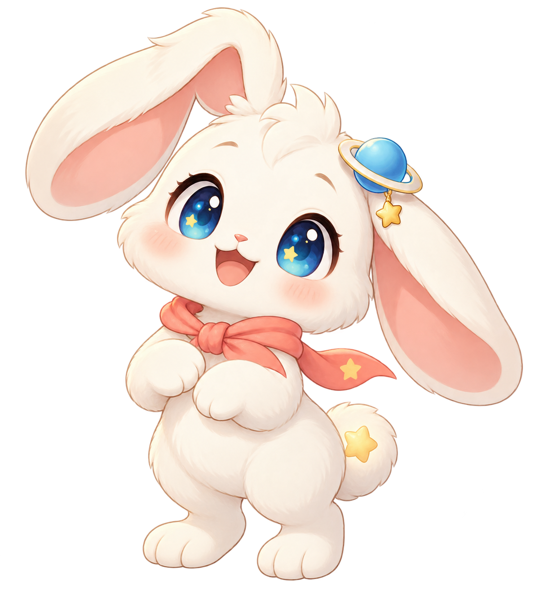
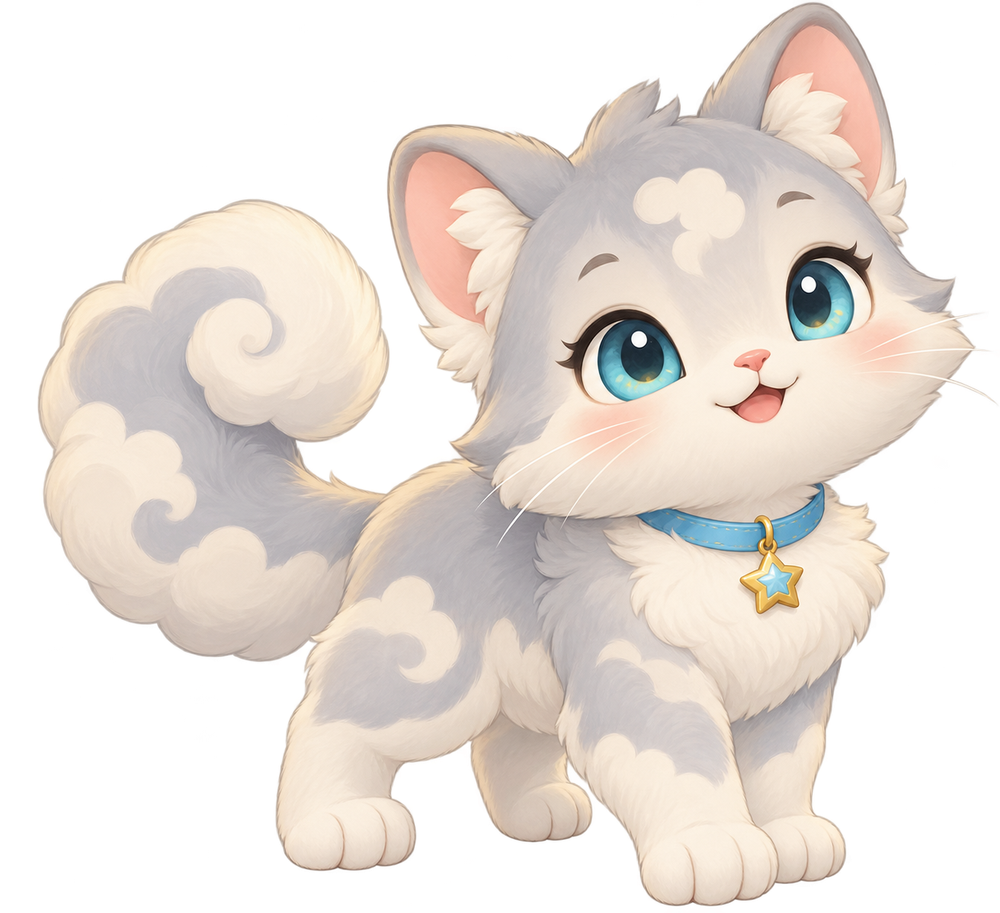
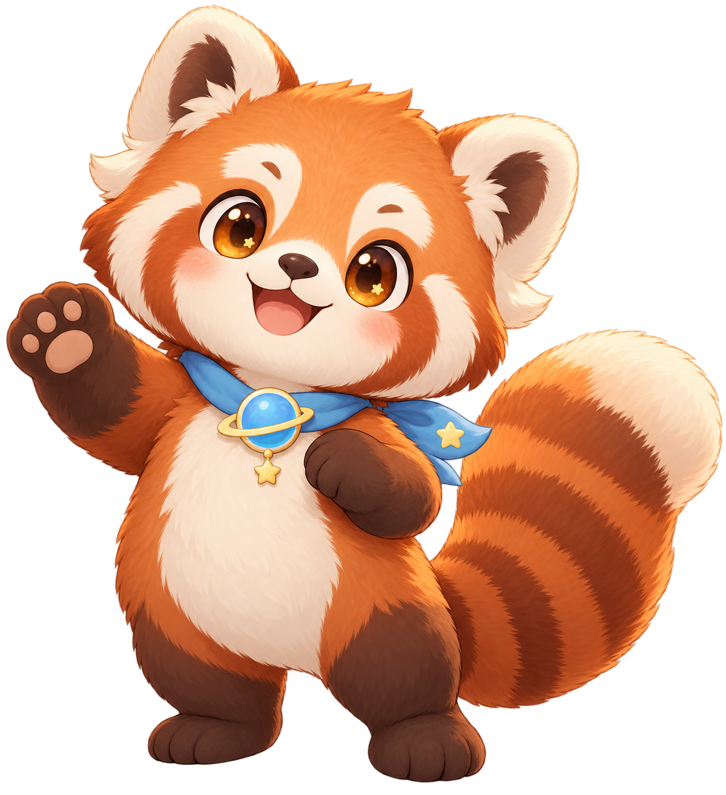

# 萌宠一期形象设定

## 定位

本设定对应《我的萌宠功能需求说明》第一阶段的“成长闭环”。三只基础萌宠没有强弱、稀有度或付费差异；学生可为领养后的宠物自由命名。它们共享学习星球的星环徽章、天蓝色与暖金色点缀，以保证在领养中心、萌宠主页和成长记录中有统一识别。

概念稿用于确定角色方向，不直接作为正式上线动画资源。正式资源需按身体、表情、饰品、装扮锚点和光效分层导出。

## 三只基础萌宠

| 品种编码 | 展示名 | 性格关键词 | 主要识别点 | 成长表达重点 |
| --- | --- | --- | --- | --- |
| `star_ring_bunny` | 星环兔 | 元气、勇敢、探索 | 长耳朵、星环耳饰、珊瑚色小围巾 | 耳饰、围巾、背包、耳朵纹样、小披风 |
| `cloud_cat` | 云朵猫 | 好奇、温柔、阅读 | 云朵花纹、卷云尾巴、星星项圈 | 尾巴纹样、项圈、阅读眼镜、睡帽、小斗篷 |
| `warm_sun_red_panda` | 暖阳小熊猫 | 温暖、认真、陪伴 | 蓬松条纹大尾巴、星环胸章、天蓝围巾 | 尾巴纹样、围巾、背带裤、徽章、守护者披风 |

### 星环兔

- 领养短句：今天也一起向前跳一小步吧！
- 动作优势：耳朵可分别支持开心、疑惑、睡觉和升级时的明显姿态变化。
- 幼崽期保持短围巾与基础耳饰；探索期增加小背包；闪耀期加入耳朵星纹；守护者阶段解锁短披风。

### 云朵猫

- 领养短句：我发现书里藏着好多星光。
- 动作优势：尾巴可反馈心情，前爪适合呈现摸摸、清洁、玩耍和答题动作。
- 幼崽期保留星星项圈；伙伴期开放基础头饰；探索期解锁阅读眼镜；守护者阶段增加云纹光效。

### 暖阳小熊猫

- 领养短句：慢慢来，认真完成每一件事。
- 动作优势：大尾巴使待机、走动、开心与睡觉有独立辨识度，挥爪可用于欢迎和鼓励。
- 幼崽期保留天蓝围巾；伙伴期开放基础服装；探索期增加尾巴纹样；守护者阶段解锁星环徽章与披风。

## 统一制作约束

- 三只宠物均需交付 `idle`、`walk`、`happy`、`eat`、`clean`、`play`、`study`、`sleep`、`level_up` 九个基础动作，以及普通、开心、疑惑、鼓励四类表情。
- 幼崽期到守护者阶段采用比例、局部部件、纹样和光效递进，不改变核心轮廓，保证学生能够持续辨认自己的伙伴。
- 角色主体保持在中央安全区；手机竖屏裁切场景边缘时，不裁切耳朵、尾巴或互动状态。
- 头饰、颈饰、服装、手持物四个装扮槽位须预留独立锚点，不能依赖在整图上直接覆盖。
- 宠物眼睛、尾巴或耳朵可以表达当天心情、饱足、整洁，但不得表达生病、离开、死亡、降级或损失。

## 下一步

在开始成长闭环业务开发前，先以星环兔完成一套可运行的 2D 分层原型：幼崽期、默认场景、待机/开心/吃东西/学习四个动作，以及经验增长和升级反馈。确认 iPad 与手机上的资源体积、帧率和布局后，再按同一骨架扩展云朵猫与暖阳小熊猫。
